# Technical Exercise in Machine Learning and Robotics (v2)

This README is organized into three parts:
1. **Instructions**: how to run the code
2. **Design**: explaning key design decisions
3. **Figures & Media**: screenshots + video demonstrating results from the different steps

## Trained model

The trained checkpoint is committed at `checkpoints/act_final/` via **Git LFS**. 

All writing in my own words 

<details>
<summary><h2>1. Instructions</h2></summary>

### System requirements
- Ubuntu 22.04, ROS2 Humble sourced
- Python 3.10 (ROS2) and Python 3.12 (LeRobot)
- Mujoco Menagerie cloned locally


### 1.1 Build the ROS2 workspace
```bash
mkdir -p ~/ros2_ws/src # standard ROS2 workspace layout

ln -s /path/to/this/repo ~/ros2_ws/src/so101_bridge # symlink repo into src/ folder

cd ~/ros2_ws && colcon build # compiles + installs ROS2 packages

source install/setup.bash # add package to ROS2 runtime env
```

note `colcon build` only needs to be re run when source code changes. but `source install/setup.bash` must be run in every new terminal session. 

### 1.2 Run the simulator + bridge

```bash
# Terminal 1 — sim + ROS2 bridge 
ros2 run so101_bridge mujoco_bridge --ros-args -p mjcf_path:=$HOME/mujoco_menagerie/robotstudio_so101/scene.xml

# Terminal 2 — demo motion driver
ros2 run so101_bridge trace_letter_i --ros-args \
  -p mjcf_path:=$HOME/mujoco_menagerie/robotstudio_so101/scene.xml \
  -p ee_site_name:=gripperframe
```
Expected result: the arm's end effector traces a capital "I" (top bar, middle stroke, bottom bar) via numerical IK 

**How to load in different robots**

`mujoco_bridge_node.py` only needs an `mjcf_path`, so any Menagerie model loads the same way:
```bash
# Franka Emika Panda
ros2 run so101_bridge mujoco_bridge --ros-args -p mjcf_path:=$HOME/mujoco_menagerie/franka_emika_panda/scene.xml

# Boston Dynamics Spot
ros2 run so101_bridge mujoco_bridge --ros-args -p mjcf_path:=$HOME/mujoco_menagerie/boston_dynamics_spot/scene.xml

# Unitree G1
ros2 run so101_bridge mujoco_bridge --ros-args -p mjcf_path:=$HOME/mujoco_menagerie/unitree_g1/scene.xml
```

### 1.3 Record an episode dataset
```bash
# Terminal 3 — recorder (python 3.10)
ros2 run so101_bridge episode_recorder --ros-args -p mjcf_path:=$HOME/mujoco_menagerie/robotstudio_so101/scene.xml
```
Run alongside Terminals 1–2 **after** the motion driver (Terminal 2) is already running.
Each episode is written to `~/lerobot_recordings/raw/episode_XXX/` (`frames/*.png`, `joint_states.jsonl`, `actions.jsonl`).

### 1.4 Convert to LeRobot dataset format
This step runs in a separate Python 3.12 environment due to LeRobot system requirements

```bash
python3.12 -m venv ~/venvs/lerobot --system-site-packages
source ~/venvs/lerobot/bin/activate
pip install -e ".[dataset]" # from within cloned lerobot repo
python3 convert_to_lerobot.py --repo-id bennytay/so101_trace_i --output-root ~/lerobot_recordings/dataset
```
Expected result: a validated `LeRobotDataset` at `~/lerobot_recordings/dataset`, with all episodes encoded via AV1/PyAV.

### 1.5 Train and run the ACT policy

Two paths are supported, depending on how much of the pipeline you want to reproduce. **Path B is faster and sufficient to see the trained policy control the arm; Path A additionally verifies the training run itself.**

**To train from scratch:**
Training needs Python 3.12 + torch.

```bash
# Host Mac, from inside the same lerobot clone used for Host Environment Setup below,
# but a separate Python 3.12 conda env with the training extras (not lerobot-viz)
conda create -n lerobot-train python=3.12 -y
conda activate lerobot-train
cd lerobot && pip install -e ".[training]"   # torch/torchvision pulled in as core deps

lerobot-train \
  --dataset.repo_id=bennytay/so101_trace_i \
  --dataset.root=$HOME/dev/lerobot_recordings/dataset_trace_i \
  --policy.type=act \
  --policy.device=mps \
  --policy.chunk_size=8 \
  --policy.n_action_steps=8 \
  --policy.push_to_hub=false \
  --output_dir=$HOME/lerobot_recordings/checkpoints/act_trace_i \
  --job_name=act_trace_i \
  --steps=5000 \
  --batch_size=8 \
  --save_freq=1000 \
  --log_freq=50 \
  --wandb.enable=false
```
`--policy.chunk_size`/`--policy.n_action_steps` are overridden down from ACT's default of 100: this dataset's episodes are only 12–15 frames long (10 episodes, 144 frames total, fps=2), so a chunk size of 100 would be almost entirely padding.


### Host Environment Setup (for dataset visualization only)

The visualizer (`lerobot-dataset-viz`) requires GPU-backed rendering and was run on the host machine (macOS, Apple Silicon) rather than the VM used for Steps 1–3. This is a separate environment from the ROS2/MuJoCo VM setup.

```bash
# Clone lerobot on the host, checked out at the same commit used for recording/conversion
git clone https://github.com/huggingface/lerobot.git
cd lerobot
git checkout 8a74e0ac6d01706d67fddfed682a09d694d9c8c0

# Create a conda environment (Python 3.12)
conda create -n lerobot-viz python=3.12 -y
conda activate lerobot-viz

# Install ffmpeg via conda (required for this install path, per LeRobot's docs)
conda install ffmpeg -c conda-forge -y

# Install with the dataset_viz extra (dataset loading + rerun-sdk)
pip install -e ".[dataset_viz]"
```

Copy the dataset from the VM to the host at this exact path — **Step 1.5's Path A training command below reads from here**, not from `~/lerobot_recordings/dataset` (that's the VM's own path from Step 1.4; the host copy lives somewhere different and is renamed):
```bash
scp -r bennytay@<vm-ip>:~/lerobot_recordings/dataset ~/dev/lerobot_recordings/dataset_trace_i
```
Then run the visualizer as described below.

</details>

<details>
<summary><h2>2. Key Design Decisions</h2></summary>

### Overall Architecture

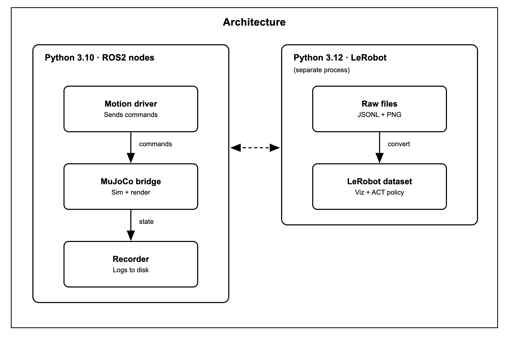

**Technical Constraint:** LeRobot requires Python 3.12+ but ROS2 Humble's rclpy requires Python 3.10, hence they can't share the same interpreter.

Therefore, the architecture deliberately splits the work into two independent OS processes, connected only by plain files on disk. The ROS2/recorder side (3.10) writes raw frames + logs; a separate LeRobot venv (3.12) reads them and builds the dataset, and later, runs training/inference.

This is because trying to reconcile the two Python versions in one process would be fragile and hard to debug. Two processes bridged by files means each side uses whatever environment suits it, and the intermediate files are also easier to inspect mid-pipeline than an in-memory queue would be. The same split reappears in Step 4: the trained policy runs in the 3.12 venv, so a thin relay is needed to get its output actions onto `so101/joint_commands`.

### Python 3.10 - ROS2 Nodes:

The pipeline comprises of 4 independent ROS2 nodes. Because none of the nodes call each other directly / know of each other, this offers a host of architectural benefits:

- Each node can be developed/tested/debugged in isolation
- Swapping or extending one aspect doesn't require editing the code of the others
- Multiple subscribers can observe the same data without conflict 
- Each node can fail without taking the others down


1: `mujoco_bridge_node.py` (the bridge)

This loads SO101's MJCF model into MuJoCo and steps the physics simultation. It is responsible for simulating the arm, and rendering the viewer window. It exposes the arm's current joint position to `so101/joint_states` and applies what it receives thru `so101/joint_commands` directly to the sim actuators. 

2: `motion.py` (motion driver)

This generates a scripted trajectory (i.e. a capital I shape) as a sequence of end-effector waypoints; solves joint angles needed to reach the waypoint thru its own IK solver; publishes the resulting joint angles to `so101/joint_commands`.

3: `episode_recorder_node.py` (recorder)

This subscribes to both `so101/joint_states` and `so101/joint_commands` and logs what it passively observes to the disk for a fixed duration per episode. 

4: `policy_bridge_node.py` (live policy relay)

This is `motion.py`'s Step-4 counterpart: same publish contract (`Float64MultiArray` on `so101/joint_commands`), but the "motion" comes from a trained ACT policy instead of a scripted IK trajectory. It mirrors the recorder's rendering setup (its own read-only MuJoCo model, subscribed to `so101/joint_states`, mirrored via `mj_forward`) to reconstruct the same observation the policy was trained on, relays it to `run_policy.py` over a local socket, and publishes back whatever action comes back.

> NOTE: The bridge, motion driver, recorder, and policy relay only ever communicate through `so101/joint_states` / `so101/joint_commands`.
>
> This is what makes the recorder (and later the policy relay) drop-in subscribers rather than something wired into the simulator's internals — any future node (a different controller, a logger, a trained policy) can plug into the same two topics without touching the bridge code. This paid off directly in Step 4, where the trained policy replaces `motion.py` with zero changes to `mujoco_bridge_node.py`.

### Implementing Inverse Kinematics

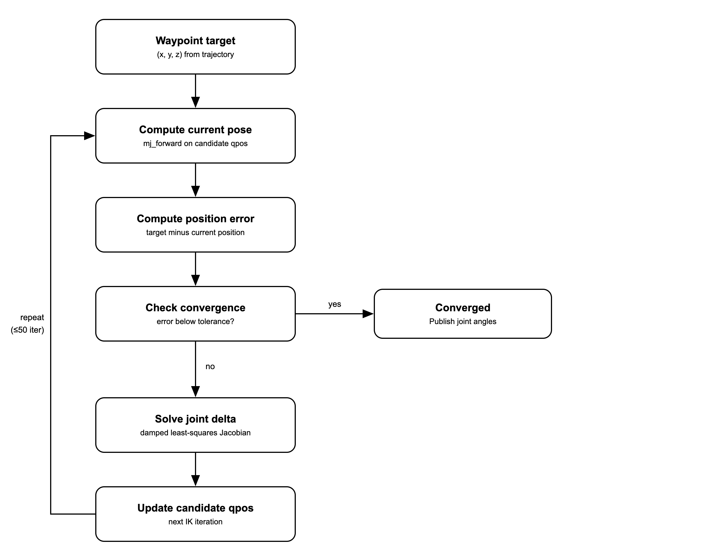

`motion.py` drives the arm through task-space control, with the desired motion described as a handful of 3D waypoints, with inverse kinematics converting each target position into the joint angles needed to get there.This process is recalculated every tick. 

This was implemented through the construction of a small Jacobian-based solver `JacobianIKSolver` in `motion.py` which is built upon the `mujoco`/`numpy` tools, and runs against a second physics-free copy of the robot model such that the trial and error calculation space doesn't interfere with the actual rendered simultation. Instead of hardcoding which specific point on the robot the inverse kinematics system aims for, the code auto discoveres and logs all robot's joint names at startup so right target can be identified for different robot model without reading through source code. 

### Headless rendering via OSMesa

Note that the recorder needs its own render pass because the LeRobot dataset requires saved camera image files per timestep compared to the live on-screen display from the MuJoCo bridge's viewer window. Thus, the recorder holds a separate MuJoCo instnace (mirroring the bridge's state) to render + write frames to disk.

The recorder uses  OSMesa software rendering (`MUJOCO_GL=osmesa`, plus `libosmesa6-dev`). This enables the recorder to run headless over SSH without crashing, because OSMesa only requires CPU cycles. In contrast, MuJoCo's default renderer GLFW needs a real display, which SSH sessions by default don't have. 

Choosing OSMesa was most practical for my hardware setup, as the VM used on my M2 Macbook Air (UTM) has no GPU passthrough, meaning I couldn't use EGL, for instance, which needs an actual GPU to be present.


### Integer FPS for dataset conversion

In real world timing, the true capture rate is fractional (e.g. 2.35Hz, 1.87Hz). But `convert_to_lerobot.py` needs to set a clear frame rate for the video when it builds the dataset.

The `av` library used for this has a function called `add_stream`. However this requires FPS be an integer, so the choice was made to set it to `2` rather than the true fractional rate.

### Lerobot Dataset: Visualization

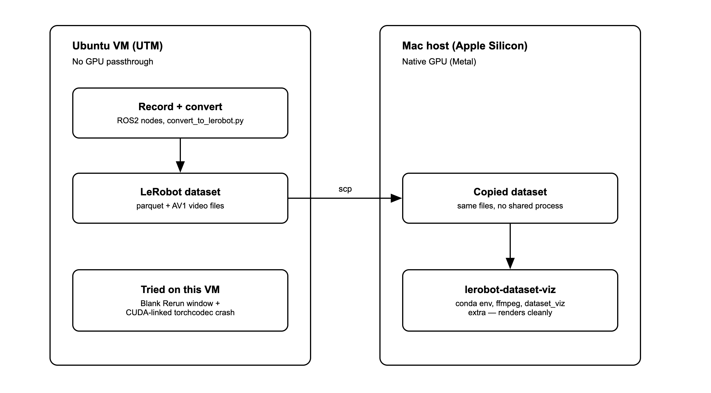

Initially, I tried to run the LeRobot datset visualisation tool on the VM, however it failed due to CUDA which doesn't exist on non-GPU. The solution was to instead copy the dataset from the VM to the host laptop (my m2 macbook) and run the visualisation tool through there.

Summary of process: The recording and conversion pipeline (Steps 1.3–1.4 above) completed successfully on the Ubuntu 22.04 ARM64 VM, producing a valid `LeRobotDataset`. The visualization step (`lerobot-dataset-viz`) was run on the host Mac (Apple Silicon, M2) rather than the VM, since it needs GPU-backed rendering that the VM's virtualized graphics stack doesn't support.

### Training the ACT policy

I trained the policy using LeRobot's own CLI. This ran on my host computer (m2 macbook air), not the VM. 

```
lerobot-train \
  --dataset.repo_id=bennytay/so101_trace_i \
  --dataset.root=$HOME/dev/lerobot_recordings/dataset_trace_i \
  --policy.type=act \
  --policy.device=mps \
  --policy.chunk_size=8 \
  --policy.n_action_steps=8 \
  --policy.push_to_hub=false \
  --output_dir=$HOME/lerobot_recordings/checkpoints/act_trace_i \
  --job_name=act_trace_i \
  --steps=5000 \
  --batch_size=8 \
  --save_freq=1000 \
  --log_freq=50 \
  --wandb.enable=false
```

Key things to note:
- the chunk size was dropped from ACT default of 100 -> 8, because the episodes (given the simple nature of the demonstrated task) are only about 12-15 frames long so the 100 chunk size is not suitable.

**What are ACT learning metrics**

Quantitative measures that track how well the model learns from data, and how effectively the resulting policy performs the intended task. 

Categories:
1. Training / optimisation metrics, done in learning process -> examples are: loss values, reconstruction error

2. Evalutation / deployment metrics, these assess final policy's performance on the actual objective. 


**Learning metrics I tracked**

`l1_loss`

$$
\text{L1 Loss} = \frac{1}{n} \sum_{i=1}^{n} |x_i - y_i|
$$

This is defined as the mean absolute deviation between two vectors. 

Why this is important:
- the small dataset (10 episodes) mean that small variations / inconsistencies are common between episodes. l1 loss is good for this beacuse it is robust to outliers because they aren't amplified (compared to l2 loss for instance). It means the model can better learn patterns without having to overfit for noise
- it is the CORE IMITATION SIGNAL: it gives the most interpretable measure of imitation quality => i.e. a decrease in l1_loss directly corresponds with an improvement in the policy, because it directly asks 'how far off is predicted action chunk from demonstrated actions?'

`kld_loss`

$$
\text{kld\_loss} = D_{KL}(q(z \mid \text{obs}, \text{actions}) \parallel p(z \mid \text{obs}))
$$

For context, ACT uses a latent variable `z` to capture different ways of doing the same task. This is important because - e.g. in the case of learning the wave 'hello'; there are different but equally valid ways of doing this, i.e. some people do a more exaggerated, some people do a small one, some people do different positions. 

`kld_loss` keeps the latent variable well behaved during training. 

Because ACT is a conditional autoencoder, the model during training does:
- encoder => produce distribution `q(z | obs, actions)`
- decoder => use sample of `z` to predict action chunk $q(z \mid \text{obs}, \text{actions})$

SO KLD loss asks how different the distrubution is, from the prior distribution. It effectively penalises the model if it piuts too much info on `z` that isn't actually inferrable from the observations. Utltimately - it enforces the effectiveness of the nature of the ACT algorithm, and handles variation. 


`loss`

This is the combined objective actually being optimized (`l1_loss + kl_weight * kld_loss`, `kl_weight=10.0`). Combines the metrics of `l1_loss` and `kld_loss` as explaning above.

`grad_norm`

$$
\text{grad\_norm} = \sqrt{\sum_{i} \left( \frac{\partial \text{loss}}{\partial w_i} \right)^2}
$$

This is a monitoring metric, and it essentially measures the magnitude of the gradients during backpropagation. 

This is important because it detects exploding gradients, and training instability. A spike / NaN here flags a bad learning rate and data issue, and this early check allows you to stop before wasting time on a broken run. 

**What was observed:**

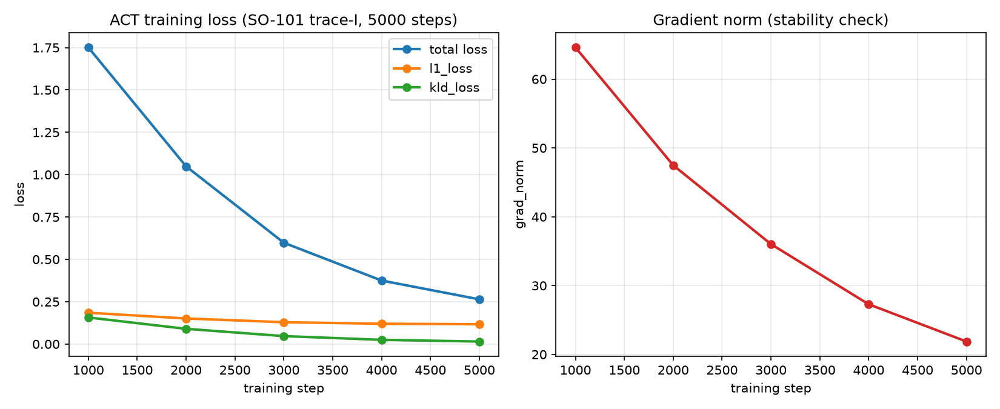

| step | total loss | l1_loss | kld_loss | grad_norm |
|---|---|---|---|---|
| 1000 | 1.751 | 0.185 | 0.157 | 64.605 |
| 2000 | 1.049 | 0.151 | 0.090 | 47.483 |
| 3000 | 0.598 | 0.129 | 0.047 | 36.026 |
| 4000 | 0.375 | 0.120 | 0.025 | 27.284 |
| 5000 | 0.264 | 0.117 | 0.015 | 21.872 |

(`total loss`/`l1_loss`/`kld_loss` are recomputed by reloading each checkpoint and re-evaluating on the full dataset, as described above — `grad_norm` isn't, since it only exists mid-backward-pass and can't be reconstructed from a saved checkpoint after the fact. Its column is instead read straight from `lerobot-train`'s own stdout log at that exact step. stdout's own running `loss` tracked the recomputed figure closely throughout too, e.g. `loss:0.270` at step 5000 vs. the recomputed 0.264 — the small gap is just dropout being active for the stdout figure's live batch vs. this table's full-dataset re-evaluation.)

`l1_loss` fell steadily and kept improving through the full run (0.185 → 0.117) => direct evidence the policy is learning to reproduce the demonstrated trajectory, exactly the "sufficient that the model starts to learn" bar the exercise sets, without claiming full convergence on a 144-frame dataset. `kld_loss` collapsed an order of magnitude (0.157 → 0.015), meaning the latent posterior converged toward the prior rather than continuing to encode extra shortcut information — a well-behaved CVAE, not a sign of trouble (`kld_loss` decaying while `l1_loss` also keeps improving is the healthy pattern; `kld_loss` bottoming out early while `l1_loss` stalls would instead suggest posterior collapse). `grad_norm` fell smoothly the whole run too (64.6 → 21.9) with no spikes — no sign of instability, consistent with the low `1e-5` learning rate `lerobot-train` uses as its ACT preset.

For `grad_norm`: it went from 64.6 at step 1000 down to 21.9 at step 5000, monotonically, with no spikes or plateaus anywhere in between. Some of that decrease is just a byproduct of `l1_loss`/`kld_loss` also falling, smaller loss generally means the loss landscape is flatter near the current weights, so gradients shrink somewhat mechanically as training approaches a local minimum, not purely because of stability.


</details>

<details>
<summary><h2>3. Figures & Media</h2></summary>

**Loading different types of robots into MuJoCo:**

| SO-101 | Franka Panda |
|---|---|
| 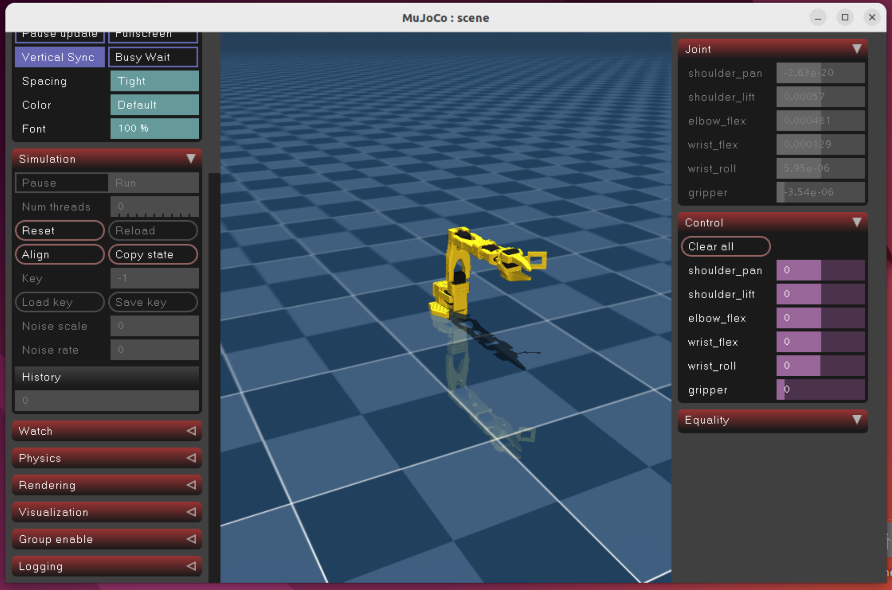 | 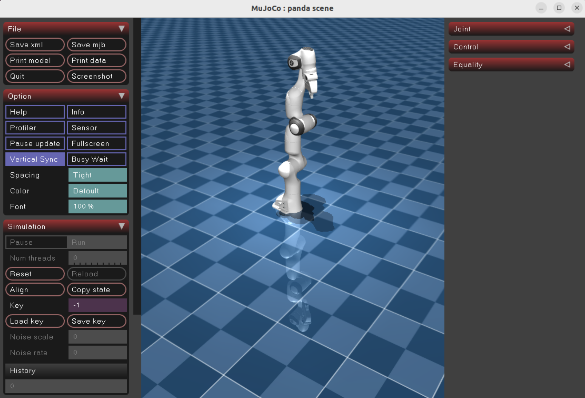 |
| **Boston Dynamics Spot** | **Unitree G1** |
| 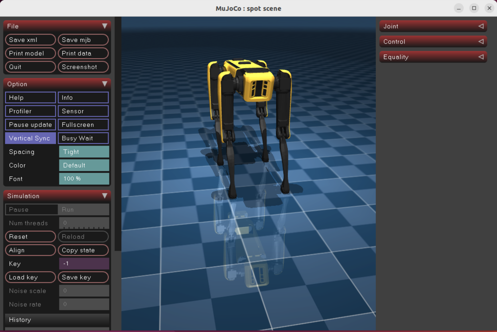 | 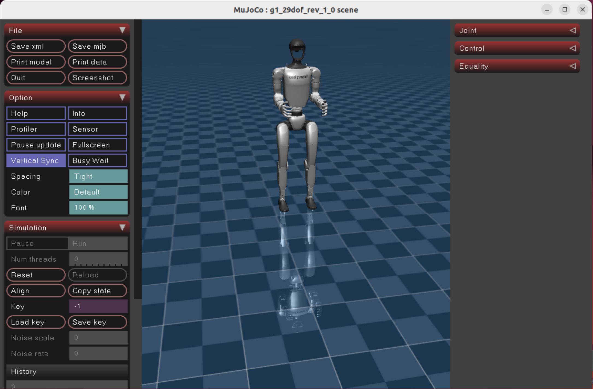 |

**Making the robot execute a simple motion:**

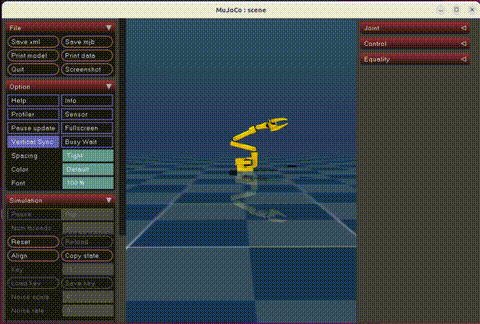

**Obtaining telemetry data:**

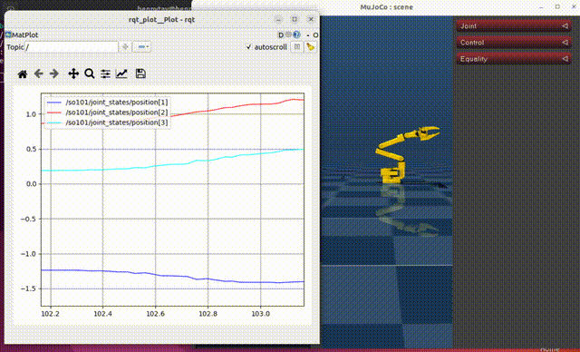

**Visualizing the recorded dataset (`lerobot-dataset-viz`):**

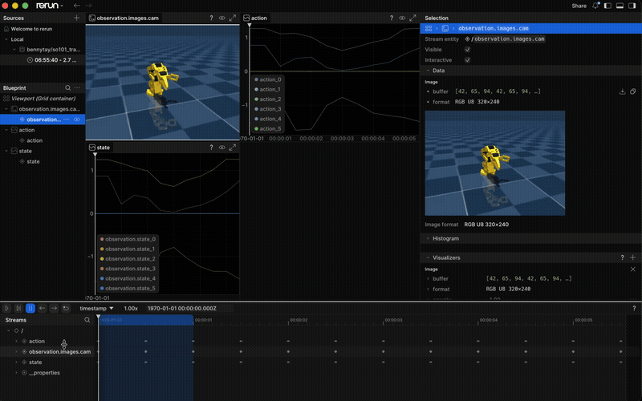

**Live deployment => arm driven by the trained ACT policy (Step 4):**

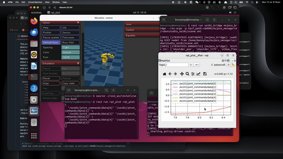

</details>